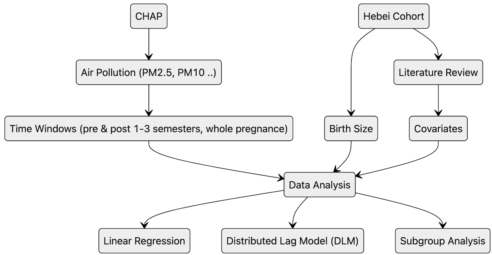

  Welcome to my academic webpage! I created this page to document my educational journey, as well as share experiences, skills, and achievements. You can also have a quick access to knowing me. I am currently pursuing a Master’s degree in the [Institute of Reproductive and Child Health](https://irch.pku.edu.cn/), [School of Public Health](https://sph.pku.edu.cn/), [Peking University](https://www.pku.edu.cn/), China. During my Master’s program, I received comprehensive training in multiple disciplines, including Epidemiology, Geographic Information Systems (GIS), and Reproductive Health. I will graduate next year and am actively seeking opportunities for a Ph.D. position in related fields.

l am interested in understanding the intricate relationships and mechanisms through which external environmental exposures influence maternal and child healt. My research work has resulted in 2 first-author papers and 8 co-authored papers. Recently, I have focused on applying interdisciplinary approaches, such as machine learning and GIS, to investigate the associations between air pollution—particularly PM2.5 and PM10—and infant birth size. 

For more details, you can find my CV here: [Zeping Yang's Curriculum Vitae](../assets/CV of Zeping Yang 2024.11.23.pdf). 

If you’d like to get in touch with me, [👉_Click here to scan my WeChat QR Code](../assets/Wechat.jpg).

<h2 id="publications">📑 Publications</h2>

**[Earlier Age at Menopause, Plasma Metabolome, and Risk of Premature Mortality](https://doi.org/10.3390/metabo14110571)**  
**Zeping Yang**, Ninghao Huang, ... , Tao Huang, Nan Li*.

- Earlier menopause is linked to an increased risk of premature mortality
- Analyzed data from 33,687 postmenopausal women aged 40–69 years in the UK Biobank.
- Identified a metabolomic signature inversely associated with premature mortality, which mediated 13.6% of the association between earlier menopause and premature death.

[👉_Click here to check out my full publications_](https://scholar.google.com/citations?user=A8k3EK4AAAAJ&hl=zh-CN) …

<h2 id="thesis">📝 Master Thesis</h2>

**The Association between Particulate Matter (PM) during pregnancy and birth size of newborns in Hebei Province, China**

**Roadmap for Zeping Yang's master Thesis**

**Recent Progress: Dose-Lag-Response effect for PM and birth size**

<h2 id="data_tool">📊🧰 Datasets and Toolsets</h2>

- Environmental Exposure Platforms:
  - [NASA](https://ladsweb.modaps.eosdis.nasa.gov/search/)
  - [GlobalHighAirPollutants (GHAP) | ChinaHighAirPollutants (CHAP) | USHighAirPollutants (USHAP)](https://weijing-rs.github.io/product.html)
  - [Tracking Air Pollution in China (TAP)](http://tapdata.org.cn/?page_id=523&lang=en)
- Cohort Platform: [UK Biobank](https://www.ukbiobank.ac.uk/)
- Lag Effect: [Distributed Lag Linear and Non-Linear Models (DLNMs)](../images/DLNM_PM25_10_Birth_length.png)
- Mixture Effect: 
  - [Bayesian Kernel Machine Regression (BKMR)](../images/BKMR.png)
  - [Quantile G-Computation](../images/Quantile_G_computation.png.png)
  - Weighted Quantile Sum (WQS) regression (Learning)

<h2 id="internships">🪪 Internships</h2>

- *2022.09 - 2022.12*, Departmental Assistant, Beijing Chaoyang District Center for Diseases Prevention and Control, Beijing, China.
- *2021.02 - 2022.01*, Medical Intern, Beijing Haidian Hospital, Beijing, China.

<h2 id="educations">👨🏻‍🎓 Educations</h2>

- *2023.09 - 2025.06*, MS, Department of Epidemiology & Biostatistics, Peking University, Beijing, China
- *2018.09 - 2023.06*, MB, School of Public Health, Peking University, Beijing, China

<h2 id="honors-and-awards">🎖 Honors and Awards</h2>

- *2023.03* Outstanding Completion, Preventive Medicine Research Project, Peking University (Group Leader)  
  [Development and Changes of Third-Party Medical Testing Institutions in China](../assets/我国第三方医学检验机构发展变化、行业现状及人才需求分析.pdf)

- *2021.05* First Prize, 29th “Challenge Cup,” Peking University (Core Member)  
  [Nucleic Acid Detection Point Allocation Based on ArcGIS: A Beijing Case Study](../assets/基于ArcGIS的核酸检测点空间布局及资源分配研究——以北京市为例.pdf)

- *2020.05* First Prize, 28th “Challenge Cup,” Peking University (Group Leader)  
  [AED Deployment and Feasibility Analysis in Peking University](../assets/北京大学AED安放数量和位置测算及可行性分析.pdf)

<h2 id="skills">💪 Skills</h2>

- Statistical Softwares: R, Stata, SPSS (Learning: SAS)
- Machine Learning: Ridge, Lasso, Elastic Regression (Improving: mlr3 book)
- Epidemiological Tools: EpiData, PASS
- GIS Tools: ArcGIS, ENVI, IDL
- Programming: Python, C, Linux Command
- Project Communication: GitHub, Markdown
- Language: Chinese, English (Learning: Russian)

<h2 id="knowledges">🌟 Knowledge Repository </h2>
This section is a repository for knowledge I think important during my work process, including notes, tutorials, codes and any materials I think maybe helpful for future work. 

I think recording and sharing them here can both help people in need and promote my enthusiasim for learning and working.

If you have any question for materials below, do not hesitate to contact me in any methods provided by this website.

- [Notes: Introduction to Machine Learning](../assets/《机器学习》2020_薛涛课件学习笔记及Chatgpt答疑内容.pdf)
- [Tutorial : Extraction and use of air pollution data in the CHAP database-from the .nc to the variable](../assets/Tutorial-Extraction and use of air pollution data in the CHAP database-from the .nc to the variable 2024.11.23.pdf)
- [R Codes for Epidemiological Research Paradigm](https://github.com/ZepingYang/R-Codes-for-Epidemiological-Research-Paradigm/)
- [Stata Codes for Epidemiological Research Paradigm (To be developed)]()

